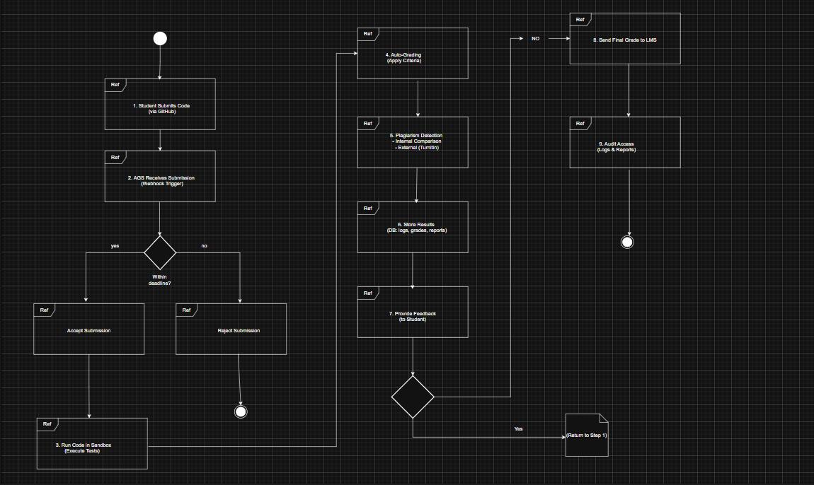
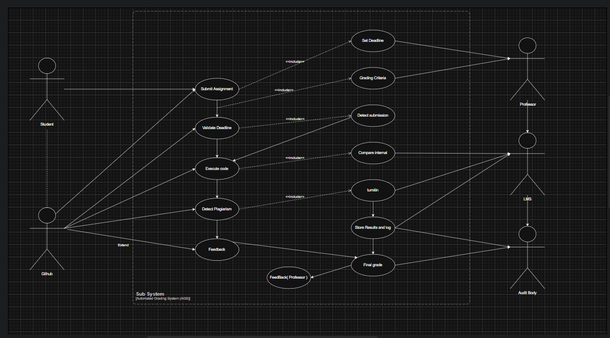
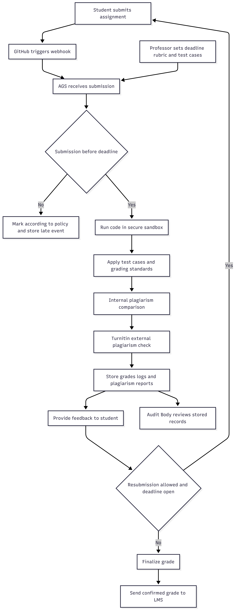

# Practical 2: USE CASE

## Interaction Overview(IoD) from an Actor-to-Actor perspective towards a business outcome

- The Automated Grading System (AGS) end-to-end workflow is represented by the Interaction Overview Diagram (IoD), which illustrates how several actors work together to accomplish the business objective of effective, equitable, and auditable grading.
- The AGS is triggered via a webhook when a student submits their assignment using GitHub, starting the process.
- The system initially verifies that the submission is submitted by the deadline set by the professor; late entries are discarded, but genuine submissions are accepted.
- After that, the approved code is run in a safe sandbox setting where predetermined test cases and grading standards are automatically applied.
- After that, the system compares submissions internally and sends them to an outside provider like Turnitin in order to detect plagiarism.
- To guarantee permanence and auditability, all results—including grades, execution logs, and plagiarism reports are kept on file.
- After then, the system gives the student thorough feedback and permits several resubmissions up until the deadline.
- After the grades are confirmed, they are sent to the university's LMS, and all records are still available for faculty and auditing body inspection.
- This interaction flow reduces manual labor while ensuring automation, integrity, and compliance.

## Functional use case(UCD) of the system

- The Use Case Diagram shows how the Automated Grading System (AGS) interacts with different actors to support the entire lifecycle of assignment submission, grading, and reporting.
- The student initiates the process by submitting their assignment via GitHub, which sets off the system.
- After that, the AGS validates the deadline using guidelines established by the professor, who is also in charge of establishing deadlines and grading standards.
- After validation, the system runs the student's code and detects plagiarism by comparing submissions internally and utilizing Turnitin for external verification.
- To guarantee traceability and compliance, the system saves all evaluation findings and logs.
- After that, the AGS provides the student with feedback and determines the final grade, which is subsequently transmitted to the LMS for formal documentation.
- The Audit Body can also review all stored data, including logs and plagiarism reports.
- Overall, the flowchart shows an organized, automated process that minimizes instructor manual labor while guaranteeing effective grading, academic integrity, and auditability.

## IoD based on the use case of the system

The IoD developed from the use case shows the sequence of interactions among actors with AGS as the coordinating system.

1. Student -> GitHub -> AGS (Webhook Trigger)
   The Student submits assignment code through GitHub, and GitHub notifies AGS through a webhook to start evaluation.

2. Professor -> AGS (Rules and Deadline Setup)
   The Professor configures deadline, test cases, and grading rubric in AGS before or during the grading cycle.

3. AGS -> Submission Validation (Decision Point)
   AGS checks whether the submission is within the deadline.
   If late, AGS marks the submission according to policy and stores the event.
   If valid, AGS proceeds to automated execution and assessment.

4. AGS -> Sandbox/Execution Engine
   AGS executes the submitted code in a secure sandbox and runs predefined tests and grading criteria.

5. AGS <-> Turnitin and Internal Comparison
   AGS performs plagiarism detection through internal similarity checks and external verification using Turnitin.

6. AGS -> Storage/Repository
   AGS stores grades, execution logs, plagiarism reports, and decision history for traceability and compliance.

7. AGS -> Student (Feedback Loop)
   AGS returns feedback to the Student.
   If resubmission is allowed and deadline remains open, the Student can resubmit and repeat the flow from Step 1.

8. AGS -> LMS (Final Grade Publishing)
   After grading is finalized, AGS sends confirmed grades to LMS for official academic recording.

9. Audit Body -> AGS/Storage (Audit Access)
   The Audit Body accesses stored records, logs, and plagiarism evidence for review and accountability.

## Requirements Analysis

The Automated Grading System (AGS) must support core functional requirements including assignment submission through GitHub, webhook-based trigger handling, deadline validation, automated code execution, plagiarism detection, feedback generation, grade finalization, and LMS integration. The system must also support resubmission handling before the deadline and maintain complete records for audit purposes.

Key actors identified from the use case are Student, Professor, LMS, Turnitin, and Audit Body. Their interactions define the system boundaries and clarify required services. Student-focused requirements emphasize submission and feedback, Professor-focused requirements emphasize grading rules and deadlines, while institutional requirements focus on traceability, compliance, and formal reporting.

## Architectural Design

The architecture follows a workflow-driven design centered on AGS as the orchestration layer. External services, such as GitHub, Turnitin, and LMS, are integrated through controlled interfaces. Internally, AGS coordinates modules for validation, execution, plagiarism analysis, result storage, and notification.

The interaction flow is event-based, beginning with a GitHub webhook and proceeding through validation, evaluation, storage, and publishing. A decision point handles late submissions, and a feedback loop supports resubmissions while the deadline remains open. This architecture separates responsibilities across components and enables maintainable, scalable, and auditable grading operations.

## Quality Attributes Consideration

The proposed design prioritizes several quality attributes. Performance is addressed through automation of testing and grading to reduce turnaround time. Reliability is supported by controlled execution in sandbox environments and consistent rule application. Security and integrity are strengthened by plagiarism checks and protected record keeping.

Auditability and traceability are ensured by storing logs, grades, and plagiarism reports for later review. Modifiability is supported by separating grading criteria and workflow components, allowing updates without redesigning the whole system. Overall, these quality attributes align with the practical objective of fair, efficient, and trustworthy academic assessment.

LINK for my AI used : https://chatgpt.com/share/69cac159-9bc0-8322-a4a5-4487d9b2cecf