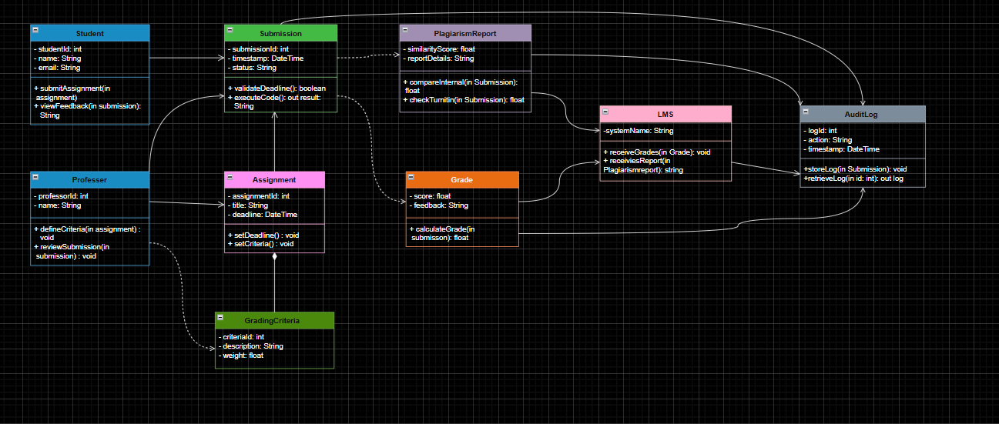

# Practical 3: Class Diagram and Object Diagram

## Class Diagram of Automated Grading System (AGS)

## Reflection on Class Diagram

`Context`: The goal of this part of the practical was to model the static structure of an Automated Grading System that can handle submission processing, grading, plagiarism checking, final grade publishing, and audit tracking. At the beginning, it was difficult to decide whether all responsibilities should be kept in one large class or distributed across multiple domain classes. I needed a structure that would be clear enough for implementation and also realistic for future enhancement.

`Action`: I looked at each part of the workflow and turned it into a class only if it had a clear role and data. Student and Professor were kept as user-side classes. Assignment, Submission, Grade, and GradingCriteria were used as the main academic classes. I added PlagiarismReport to keep plagiarism work separate from grading work. LMS and AuditLog were kept as support/integration classes. After that, I checked all class links to make sure no class was doing duplicate work and that the flow matched the real process. I also checked where methods should go, like validation in Submission and score calculation in Grade.

`Result`: The final class diagram became much clearer and easier to understand. Each class now has one main responsibility, so the design is less confusing and less tightly connected. This also makes implementation easier because the relationships follow the grading process step by step. One important result was identifying Submission as the central class because it connects student activity, assignment details, grading output, plagiarism results, and reporting.

`Learning`: I learned that a class diagram is not just for presentation; it helps make good design decisions. Design quality improves when each class handles its own data and behavior. I also learned that audit logging is very important in academic systems and should be included from the start. This activity helped me understand how object-oriented design supports maintainability, scalability, and reliability. In future, I will check each class with one simple question: does this class have a clear and unique responsibility?

## Object Diagram of Automated Grading System (AGS)

## Reflection on Object Diagram

`Context`: After finishing the class diagram, I needed to check if the system design also made sense when running in a real situation. A class diagram shows structure, but it does not clearly show runtime flow between actual objects. So I used the object diagram to understand one complete submission event from beginning to end.

`Action`: I treated the object diagram as a runtime snapshot and followed the interaction between actual objects, such as a student object, assignment object, submission object, grade object, and plagiarism report object. I traced the process in order: submission received, deadline check, code execution, grading, plagiarism checking, storing results, giving feedback, and sending final output. I also checked where audit logs are created for tracking. This helped me connect class-level design to real system behavior.

`Result`: The runtime view confirmed that the design supports the full grading cycle without major gaps. I could clearly see how data moves through each step and how each object contributes to the process. It also showed that grading results and plagiarism reports are connected parts of one full workflow that ends with LMS update and audit records. This made me more confident that the model can handle practical rules like deadline checking and resubmission.

`Learning`: I learned that object diagrams are very useful for checking real behavior, especially in systems with many connected steps. The class diagram tells what the system contains, while the object diagram shows how the system actually works during execution. I also realized that runtime thinking helps find small design assumptions, like when status changes happen and when logs should be stored. In future, I will always use both diagrams together: class diagram for structure and object diagram for behavior checking.

`LINK for my AI used : https://chatgpt.com/share/69cac159-9bc0-8322-a4a5-4487d9b2cecf`